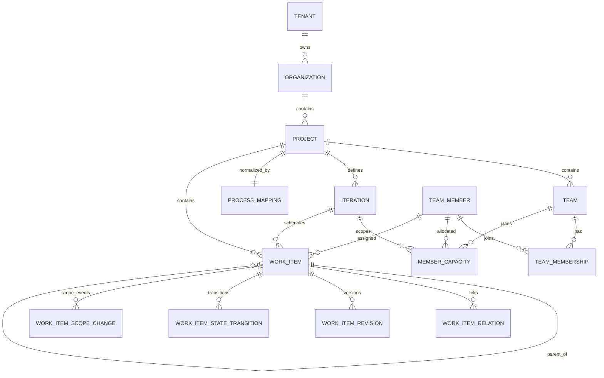
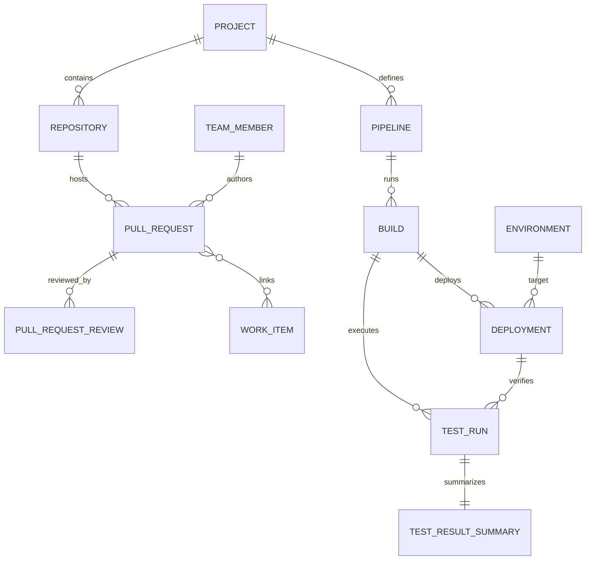
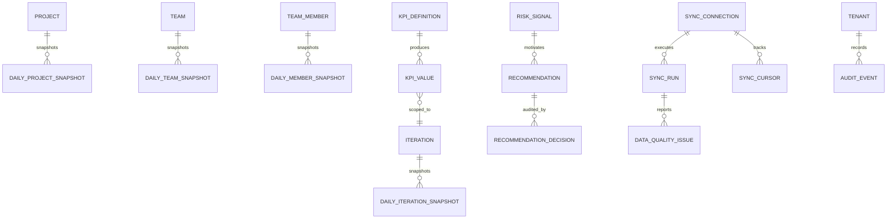

# Domain Model

Phase 2 specification. No database objects are created here.

Types: `src/types/domain/*`. Raw provider shapes: `src/types/azure/*`.

## Record classes

Every entity is one of:

| Class          | Meaning                              | Mutability             |
| -------------- | ------------------------------------ | ---------------------- |
| `azure_source` | Raw payload cached from Azure DevOps | Replaced per sync      |
| `normalized`   | Current-state entity used by the app | Updated per sync       |
| `history`      | Immutable event/revision             | Append-only            |
| `calculated`   | Derived snapshot or KPI value        | Append-only per period |
| `ai_generated` | Model-produced text/insight          | Append-only, versioned |

## Entity catalog

Legend — PK: internal UUID unless stated. AzureID: source identifier. Owner: tenancy boundary. Freq: expected update frequency. Retention: default policy (configurable per tenant).

### Delivery data

| Entity                  | PK   | Azure ID           | Owner          | Parents                             | Children                                    | Required                                              | Nullable                                     | Class      | Freq   | Retention   |
| ----------------------- | ---- | ------------------ | -------------- | ----------------------------------- | ------------------------------------------- | ----------------------------------------------------- | -------------------------------------------- | ---------- | ------ | ----------- |
| Tenant                  | `id` | —                  | self           | —                                   | Organization, users, roles                  | name, slug                                            | —                                            | normalized | rare   | indefinite  |
| Organization            | `id` | `accountId`/name   | tenant         | Tenant                              | Project, SyncConnection                     | azureOrganizationName                                 | azureOrganizationId, connectedAt             | normalized | daily  | indefinite  |
| Project                 | `id` | `azureProjectId`   | tenant+org     | Organization                        | Team, WorkItem, Repository, Pipeline        | azureProjectId, name, processTemplateKind             | description, processMappingId, visibility    | normalized | daily  | indefinite  |
| Team                    | `id` | `azureTeamId`      | tenant+project | Project                             | TeamMembership, Iteration binding, capacity | azureTeamId, name                                     | description, defaultIterationPath            | normalized | daily  | indefinite  |
| Iteration               | `id` | `azureIterationId` | tenant+project | Project                             | TeamIteration, WorkItem                     | azureIterationPath, name                              | startDate, finishDate                        | normalized | daily  | indefinite  |
| TeamIteration           | `id` | —                  | tenant+team    | Team, Iteration                     | snapshots, capacity, calendar               | teamId, iterationId, timeZone, workingWeekdays        | teamDaysOff, selectedForSync                 | normalized | daily  | indefinite  |
| TeamMember              | `id` | `azureDescriptor`  | tenant+org     | Organization                        | memberships, capacity, assignments          | displayName, azureDescriptor                          | email, uniqueName, avatarUrl, role           | normalized | daily  | indefinite  |
| TeamMembership          | `id` | —                  | tenant+team    | Team, TeamMember                    | —                                           | teamId, memberId                                      | joinedAt, leftAt                             | history    | daily  | indefinite  |
| MemberCapacity          | `id` | —                  | tenant+team    | TeamIteration, TeamMember           | —                                           | teamIterationId, memberId                             | availableCapacityHours, availableWorkingDays | normalized | hourly | 3 years     |
| WorkItem                | `id` | `System.Id`        | tenant+project | Project, Iteration, parent WorkItem | children, revisions, relations              | azureWorkItemId, azureRev, title, state               | estimate, assignedTo, iterationId, dates     | normalized | 15 min | indefinite  |
| WorkItemRelation        | `id` | relation `rel`+url | tenant+project | WorkItem                            | —                                           | sourceWorkItemId, targetAzureWorkItemId, relationType | targetWorkItemId                             | normalized | 15 min | indefinite  |
| WorkItemRevision        | `id` | `System.Rev`       | tenant+project | WorkItem                            | —                                           | workItemId, rev, revisedAt                            | revisedByMemberId, estimate                  | history    | 15 min | 3 years min |
| WorkItemStateTransition | `id` | derived            | tenant+project | WorkItem                            | —                                           | toState, occurredAt, sourceRev                        | fromState, durationHours                     | history    | 15 min | 3 years min |
| WorkItemScopeChange     | `id` | derived            | tenant+project | WorkItem, Iteration                 | —                                           | changeType, occurredAt                                | estimateAtChange                             | history    | 15 min | 3 years min |

### Engineering data

| Entity            | PK   | Azure ID              | Owner          | Parents            | Children            | Required                                    | Nullable                                          | Class                               | Freq   | Retention  |
| ----------------- | ---- | --------------------- | -------------- | ------------------ | ------------------- | ------------------------------------------- | ------------------------------------------------- | ----------------------------------- | ------ | ---------- |
| Repository        | `id` | `azureRepositoryId`   | tenant+project | Project            | PullRequest         | name, azureRepositoryId                     | defaultBranch                                     | normalized                          | daily  | indefinite |
| PullRequest       | `id` | `pullRequestId`       | tenant+project | Repository         | PullRequestReview   | azurePullRequestId, status, createdAtSource | firstMeaningfulReviewAt, completedAt, abandonedAt | normalized                          | 15 min | 2 years    |
| PullRequestReview | `id` | reviewer descriptor   | tenant+project | PullRequest        | —                   | vote                                        | reviewerMemberId, firstResponseAt                 | normalized                          | 15 min | 2 years    |
| Pipeline          | `id` | definition id         | tenant+project | Project            | Build               | azurePipelineId, name, kind                 | repositoryId, defaultBranch                       | normalized                          | daily  | indefinite |
| Build             | `id` | build id              | tenant+project | Pipeline           | Deployment, TestRun | azureBuildId, status, queuedAt              | result, startedAt, finishedAt, durationSeconds    | normalized→immutable once completed | 15 min | 1 year     |
| Environment       | `id` | environment id        | tenant+project | Project            | Deployment          | name                                        | azureEnvironmentId, rank                          | normalized                          | daily  | indefinite |
| Deployment        | `id` | deployment/release id | tenant+project | Environment, Build | approvals           | azureDeploymentId, status, attempt          | buildId, startedAt, finishedAt                    | normalized→immutable once finished  | 15 min | 2 years    |
| TestRun           | `id` | run id                | tenant+project | Build/Deployment   | TestResultSummary   | azureTestRunId, state                       | buildId, deploymentId, completedAt                | normalized                          | 15 min | 1 year     |
| TestResultSummary | `id` | derived               | tenant+project | TestRun            | —                   | totals                                      | passRate, durationSeconds                         | calculated                          | 15 min | 1 year     |

### Analytics, intelligence and operations

| Entity                 | PK           | Azure ID | Owner          | Parents          | Children               | Required                                    | Nullable                        | Class                      | Freq          | Retention  |
| ---------------------- | ------------ | -------- | -------------- | ---------------- | ---------------------- | ------------------------------------------- | ------------------------------- | -------------------------- | ------------- | ---------- |
| DailyProjectSnapshot   | `id`         | —        | tenant+project | Project          | —                      | snapshotDate, counts                        | rates                           | calculated                 | daily         | 3 years    |
| DailyIterationSnapshot | `id`         | —        | tenant+team    | TeamIteration    | —                      | teamIterationId, snapshotDate, scope fields | estimates when unconfigured     | calculated                 | daily         | 3 years    |
| DailyTeamSnapshot      | `id`         | —        | tenant+team    | Team             | —                      | snapshotDate                                | capacity fields                 | calculated                 | daily         | 3 years    |
| DailyMemberSnapshot    | `id`         | —        | tenant+team    | TeamMember, Team | —                      | snapshotDate                                | capacity fields                 | calculated                 | daily         | 18 months  |
| KpiDefinition          | `id` (KpiId) | —        | global catalog | —                | KpiValue               | id, formula, thresholds                     | minimumHistoryDays              | normalized (config)        | on release    | indefinite |
| KpiValue               | `id`         | —        | tenant+scope   | KpiDefinition    | —                      | kpiId, measure, validFrom, stamp            | value, comparison               | calculated                 | on sync/daily | 3 years    |
| RiskSignal             | `id`         | —        | tenant+project | rules            | Recommendation         | ruleId, severity, evidence                  | ownerMemberId, resolvedAt       | calculated                 | on sync       | 2 years    |
| Recommendation         | `id`         | —        | tenant+project | RiskSignal       | RecommendationDecision | title, reason, status                       | accepted/hidden/completed times | calculated or ai_generated | on sync       | 2 years    |
| RecommendationDecision | `id`         | —        | tenant         | Recommendation   | —                      | decision, decidedByUserId, decidedAt        | comment                         | history                    | on action     | indefinite |
| SyncConnection         | `id`         | —        | tenant+org     | Organization     | SyncRun, SyncCursor    | authMode, secretRef, scopes                 | lastVerifiedAt                  | normalized                 | rare          | indefinite |
| SyncRun                | `id`         | —        | tenant         | SyncConnection   | —                      | status, startedAt, counters                 | completedAt                     | history                    | per run       | 180 days   |
| SyncCursor             | `id`         | —        | tenant         | SyncConnection   | —                      | entityKind, overlapMinutes                  | changedSince, continuationToken | normalized                 | per run       | indefinite |
| DataQualityIssue       | `id`         | —        | tenant         | rules            | —                      | ruleId, severity, firstSeenAt               | entityId, field, resolvedAt     | calculated                 | per run       | 1 year     |
| AuditEvent             | `id`         | —        | tenant         | —                | —                      | action, occurredAt, actorKind               | actorUserId, ipAddress          | history                    | per event     | 2 years    |

## Relationship diagrams

### 1. Delivery data



### 2. Engineering data



### 3. Analytics and synchronization



## Multi-tenant boundary

Every customer-owned row carries `tenantId`, plus `organizationId`, `projectId`, `teamId` where the entity lives below those levels. Rules:

1. `tenantId` is never derived from client input; it is resolved server-side from the authenticated session.
2. Composite uniqueness always includes the tenant, e.g. `(tenant_id, organization_id, azure_work_item_id)`. Azure ids are only unique inside one Azure organization.
3. Every foreign key pairs with the tenant (`FOREIGN KEY (tenant_id, project_id)`), so a child can never point at another tenant's parent.
4. Phase 3 adds RLS on every table: `tenant_id = current_tenant_id()` where `current_tenant_id()` is a `security definer` function reading the user's membership row — never a client-supplied claim alone.
5. Sync jobs bind one connection to one tenant/organization pair; the worker refuses writes whose resolved tenant differs from the run's tenant.
6. Storage paths, cache keys and log correlation ids are prefixed with the tenant slug.
7. MATN is tenant #1, not a special case: no code path may assume a single tenant.

## Work-item hierarchy

Supported aliases: `epic`, `feature`, `story` (User Story / Product Backlog Item), `requirement`, `issue`, `bug`, `task`, `testCase`, `custom`. The mapping is data, not code (`ProcessMapping.workItemTypeAliases`, `hierarchyRules`).

Relations normalized: parent/child (`System.LinkTypes.Hierarchy-*`), related, predecessor/successor (`System.LinkTypes.Dependency-*`), duplicate/duplicateOf, tests/testedBy (`Microsoft.VSTS.Common.TestedBy-*`), affects.

Roll-up: Task → Story → Feature → Epic. Completion percentage at each level equals completed roll-up estimate over total roll-up estimate for the chosen mode.

Double counting is prevented by picking exactly one estimate source per subtree:

| Mode              | Rule                                                                                                          |
| ----------------- | ------------------------------------------------------------------------------------------------------------- |
| `leaf_only`       | Only leaf items contribute estimates; parents are containers (default for Scrum/Agile with task-level hours). |
| `parent_only`     | Only requirement-level items contribute; child task estimates are ignored (default for story-point teams).    |
| `process_mapping` | Contribution level is defined per alias in the process mapping.                                               |
| `story_level`     | Delivery KPIs are computed strictly at story/PBI/requirement level; bugs follow `bugHandlingMode`.            |

If a parent and its children both carry estimates in `leaf_only` or `parent_only` mode, the ignored side is recorded as a `missing_estimate`/informational data-quality note rather than silently summed.

## Iterations and sprint calendar

Contracts: `Iteration` (project-owned Azure node), `TeamIteration` (per-team subscription and settings) and `SprintCalendar` (`src/types/domain/iteration.ts`).

```text
Project ──< Iteration (one Azure node, stored once)
                 │
Team ──────< TeamIteration >──┘   (isCurrent, timeZone, workingWeekdays, selectedForSync)
                 │
                 ├─< MemberCapacity            key (tenant_id, team_iteration_id, member_id)
                 ├─< DailyIterationSnapshot    key (tenant_id, team_iteration_id, snapshot_date)
                 ├─< DailyTeamSnapshot         team_iteration_id nullable (no sprint that day)
                 ├─< DailyMemberSnapshot       team_iteration_id nullable
                 ├─< KpiValue / RiskSignal / Recommendation (sprint-scoped rows)
                 ├─< MemberLoad (calculated)
                 └─< SprintCalendar (derived)
```

The same Azure iteration is reused by many teams without duplicating the node; dates and path live only on `Iteration`, while time zone, working weekdays, days off, `isCurrent` and `selectedForSync` live only on `TeamIteration`. Sync order: iteration nodes first, then team subscriptions, then capacity.

- Working days come from team settings (`workingDays`), minus team days off and public holidays.
- `elapsedWorkingDays / totalWorkingDays * 100` — never raw calendar days.
- Day boundaries resolve in the **team iteration** `timeZone` (tenant default `Africa/Cairo`).

Edge cases:

| Case                               | Behavior                                                                                                                                   |
| ---------------------------------- | ------------------------------------------------------------------------------------------------------------------------------------------ |
| Missing start or finish date       | `phase = "undated"`, calendar values `null`, Expected Completion returns `missing_source`.                                                 |
| Future sprint                      | `elapsedWorkingDays = 0`; trajectory shows plan only.                                                                                      |
| Finished sprint                    | Elapsed capped at total; snapshots frozen.                                                                                                 |
| Shared iteration node across teams | One `Iteration` row, one `TeamIteration` row per team; the calendar is keyed on `teamIterationId`.                                         |
| Holidays                           | Merged into `nonWorkingDays` with kind `holiday`.                                                                                          |
| Mid-sprint membership change       | Capacity is pro-rated by `TeamMembership.joinedAt/leftAt` overlap with working days.                                                       |
| Time-zone boundary                 | Snapshot business date uses the team iteration time zone, not UTC midnight.                                                                |
| Source deletion                    | Iteration nodes carry `sourceStatus`; a deleted node is tombstoned, its `TeamIteration` rows are marked inaccessible, and history is kept. |

## Capacity model

See `src/types/domain/capacity.ts`.

`utilizationPercentage = assignedRemainingHours / availableCapacityHours * 100`

| Case                     | Behavior                                                                                                     |
| ------------------------ | ------------------------------------------------------------------------------------------------------------ |
| Zero or missing capacity | `value = null`, `availability = "missing_source"`; the UI shows "capacity not configured", not 0%.           |
| Missing estimates        | Value still returned, `estimateCoverage < 1` and a warning surfaces; the number is never presented as exact. |
| Part-time member         | Capacity comes from `capacityPerDay` × available working days; no assumption of 8h.                          |
| Multiple activities      | `availableCapacityHours` sums all activity capacities; per-activity utilization is available for drill-down. |
| Member in several teams  | Capacity is per (member, team, iteration); a cross-team view sums capacity and flags `sharedAcrossTeams`.    |
| Leave mid-iteration      | `daysOff` reduce available working days for that member only.                                                |

Bands are configuration (`UtilizationBands`), proposed defaults: under ≤ 70, balanced ≤ 95, near ≤ 110, over > 110.

The model deliberately produces no productivity score and no per-person ranking; item counts qualify capacity, they never rate people.

## Historical preservation

`WorkItemRevision`, `WorkItemStateTransition`, `WorkItemScopeChange`, all daily snapshots and `RecommendationDecision` are append-only. Sync writes use `INSERT ... ON CONFLICT DO NOTHING` on their natural keys, so a re-run can fill gaps but never rewrite closed history. Only current-state tables are upserted.

## Authorization scopes

Contracts: `src/types/domain/authorization.ts`.

| Entity             | Owner  | Required                     | Uniqueness                                                    |
| ------------------ | ------ | ---------------------------- | ------------------------------------------------------------- |
| UserRoleAssignment | tenant | userId, role                 | `(tenant_id, user_id, role)`                                  |
| UserProjectScope   | tenant | userId, projectId, grantedAt | active-only partial unique `(tenant_id, user_id, project_id)` |
| UserTeamScope      | tenant | userId, teamId, grantedAt    | active-only partial unique `(tenant_id, user_id, team_id)`    |

Grants are revoked (`revokedAt`) or expired (`expiresAt`), never deleted, so access history stays auditable. `AuthorizationContext` is resolved server-side per request; the UI never asserts scope.

## Source lifecycle

Every Azure-sourced entity extends `SourceTracked`: `sourceStatus` (`active | deleted | inaccessible | unknown`), `isDeleted`, `deletedAtSource`, `lastSeenAt`, `accessRevokedAt`. Deletion and lost access are distinguishable at all times; history tables are never tombstoned.

## Canonical team-sprint reference (Phase 2.2)

`teamIterationId` is the **only** persisted team-sprint relationship. Contracts carrying it: `MemberCapacity`, `MemberLoad`, `DailyIterationSnapshot`, `DailyTeamSnapshot`, `DailyMemberSnapshot`, `KpiValue`, `RiskSignal`, `Recommendation`, `SprintCalendar`, and `DashboardContext`.

- `teamId` and `iterationId` may still appear beside it, but only as **derived convenience values** — explicitly documented in the TypeScript contracts and never a foreign key of record in the database.
- `DailyIterationSnapshot` identity is `(tenant_id, team_iteration_id, snapshot_date)`.
- Team/member snapshots allow `teamIterationId = null` for days with no active sprint; when it is set, `iterationId` is derived from it.
- Selecting a team and an iteration independently is no longer expressible: the pair must resolve to a `TeamIteration` row first, and that row is structurally constrained to a single project.
